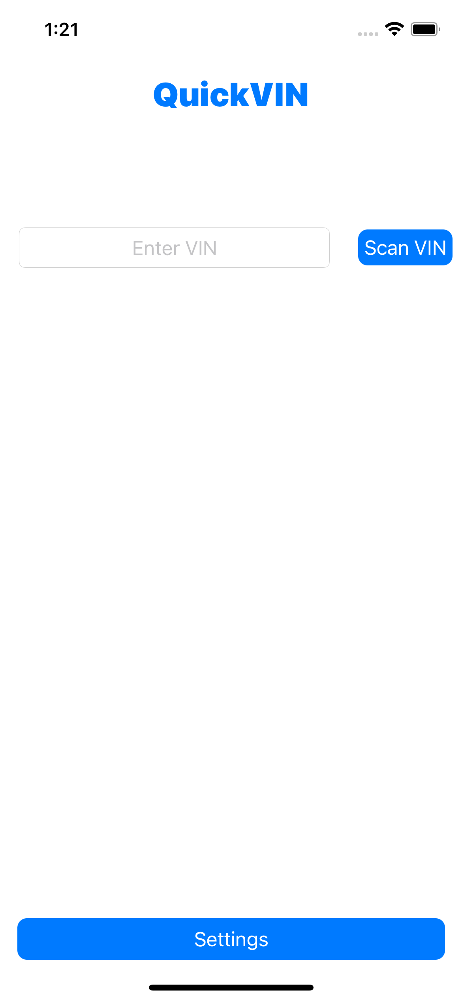
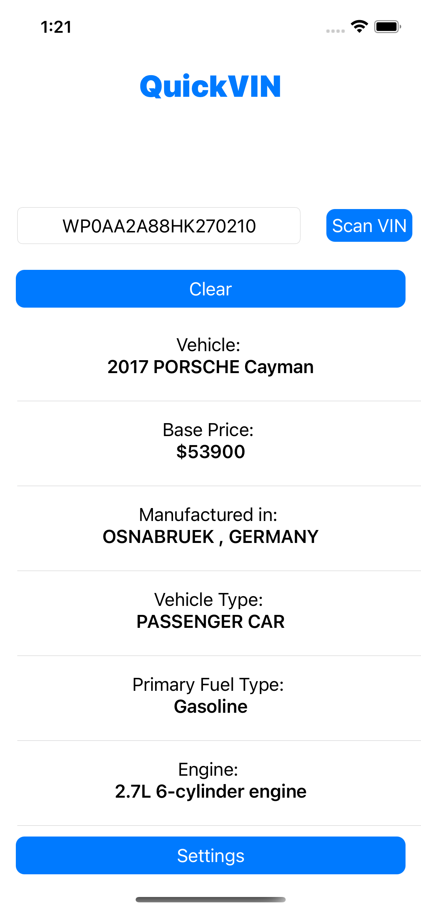
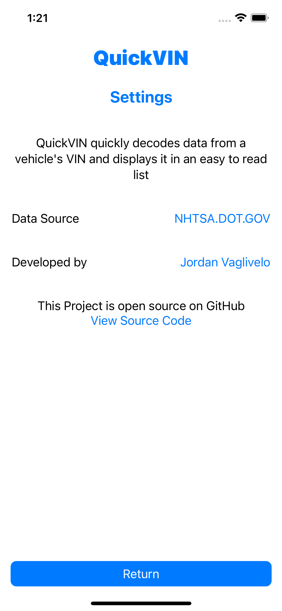

# QuickVIN

## What is it?
A Simple VIN Decoder for iOS written in SwiftUI

## Screenshots
| Home Screen  | Decoded VIN | Settings Screen |
| ------------- | ------------- | ------------- |
|   |   |    |

## Requirements
Written in SwiftUI and Swift, requires iOS 14.0+

## Dependencies
* [CodeScanner Swift Package](https://github.com/twostraws/CodeScanner)
* [NHTSA Vehicle API](https://vpic.nhtsa.dot.gov/api/)